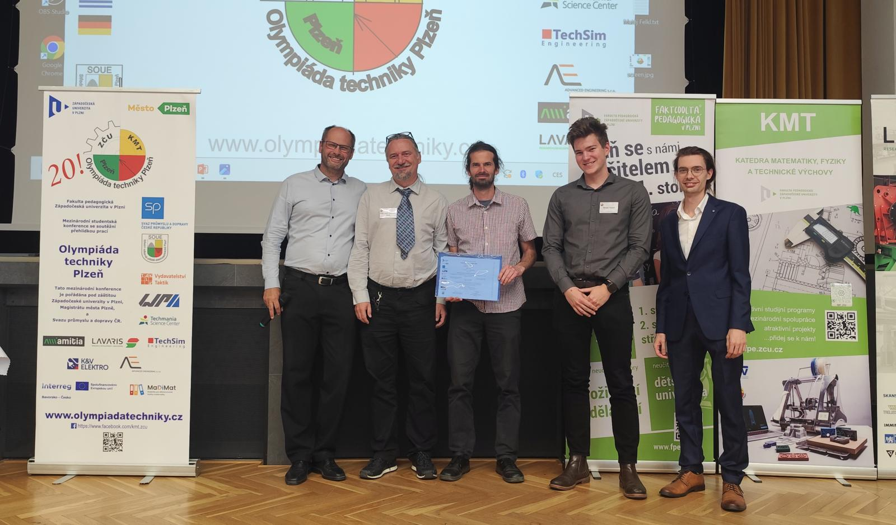
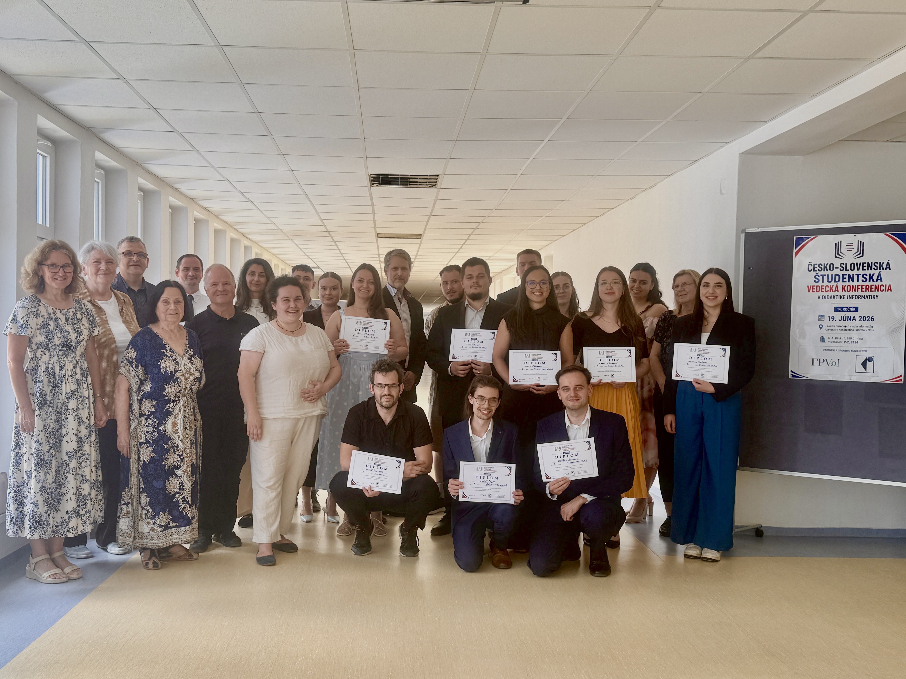

+++
title = "Studenti KITTV uspěli na prestižních studentských soutěžích"
date = 2026-06-26

[extra]
expiration = 2026-10-01
+++

Studenti Katedry informačních technologií a technické výchovy Pedagogické fakulty zaznamenali na konci akademického roku 2025/2026 významné úspěchy na dvou odborných soutěžích zaměřených na didaktiku informatiky a technické vzdělávání.

<!-- more -->

Prvního výrazného úspěchu dosáhli naši studenti 15. května 2026 na soutěži [Olympiáda techniky Plzeň 2026](https://olympiadatechniky.cz/), kterou pořádala Katedra matematiky, fyziky a technické výchovy Fakulty pedagogické Západočeské univerzity v Plzni. V kategorii zaměřené na informační technologie zvítězil student studijního programu IT–Chemie **Štěpán Tomek** s prací Webový portál pro prelaboratorní přípravu a simulaci chemických aparatur (vedoucí práce PhDr. Josef Procházka, Ph.D.). Druhé místo získal rovněž student KITTV **Petr Sysel** se svou diplomovou prací Online prostředí Kodeon pro podporu výuky algoritmizace na základní škole (vedoucí práce PhDr. Josef Procházka, Ph.D.).

Petr Sysel navázal na svůj úspěch 19. června 2026 získáním první ceny na [14. ročníku Česko-slovenské studentské vědecké konference v didaktice informatiky](https://svk-ukf.sk/conference/di), kterou pořádala Fakulta prírodných vied a informatiky Univerzity Konštantína Filozofa v Nitře. Druhé místo v sekci diplomových prací obsadil **Vojtěch Benýšek** se svou prací Rozvoj gramotnosti žáků v oblasti umělé inteligence ve výuce informatiky (vedoucí práce PhDr. Jiří Štípek, Ph.D.).
    
Všem oceněným studentům srdečně gratulujeme k dosaženým výsledkům, děkujeme za výbornou reprezentaci KITTV i celé Pedagogické fakulty a přejeme mnoho dalších studijních i profesních úspěchů.
