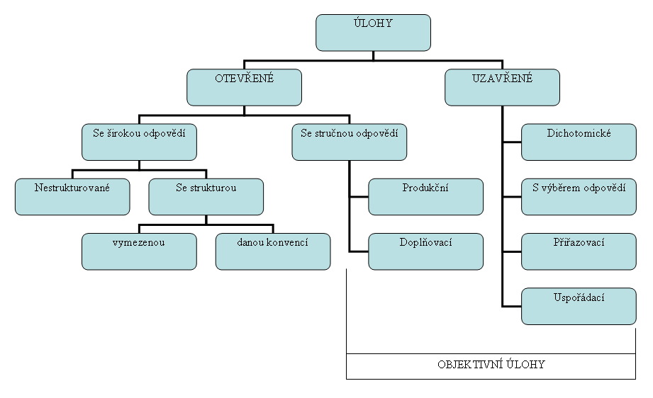

+++
title = "Poznámky k pedagogickému výzkumu" 

[extra]
heading = "Poznámky k pedagogickému výzkumu"
+++
## Obsah
- [Pedagogický výzkum](#pedagogicky-vyzkum)
- [Metody pedagogického výzkumu](#metody-pedagogickeho-vyzkumu)
    - [Pozorování](#pozorovani)
    - [Dotazník](#dotaznik)
    - [Interview](#interview-rozhovor)
    - [Experiment v pedagogickém výzkumu](#experiment-v-pedagogickem-vyzkumu)
    - [Testy a testování v ped. výzkumu](#testy-a-testovani-v-ped-vyzkumu)
- [Zpracování a interpretace výsledků výzkumu](#zpracovani-a-interpretace-vysledku-vyzkumu)

# Pedagogický výzkum

### Klíčová slova
empirický výzkum, aplikovaný výzkum, teoretický výzkum,
základní výzkum, kvalitativní výzkum, kvantitativní výzkum, akční
výzkum, projekt výzkumu, metody výzkumu

### Vymezení pojmu a typy pedagogického výzkumu

Výzkum v pedagogice je zaměřen převážně na popis, analýzu a interpretaci
vzdělávací reality. Nejčastěji se jedná o **empirický výzkum**, zaměřený
na konkrétní jevy v oblasti vzdělávání. Jeho výsledky se zpravidla
aplikují ve školské praxi, má tedy charakter **aplikovaného výzkumu.**

Součástí pedagogického výzkumu je (měl by být) i **základní,
teoretický výzkum.**

Základní výzkum je zaměřen na základní (klíčové) problémy a otázky
v teorii pedagogiky. Jeho výsledky přispívají k vysvětlení významných
jevů a otázek v oblasti vzdělávání ( např. funkce vzdělávání v současné
společnosti).

**Aplikovaný a základní výzkum by se měly vzájemně doplňovat a ovlivňovat.**

Pedagogický výzkum využívá metodologii založenou na různých
filosofických základech. Z pozitivizmu vychází **kvantitativní výzkum**,
založený na přesně vymezených metodách zkoumání poskytujících
kvantifikovatelné výsledky. Fenomenologie je základem **kvalitativního
výzkumu.** Zdrojem dat je přirozené prostředí, ve kterém se uskutečňuje
terénní výzkum. Výsledkem je nejčastěji detailní popis sledovaného
případu ( případová studie), zpracovaný většinou na základě různých
druhů pozorování a rozhovorů.

Kvantitativní výzkum má v pedagogice dlouhou tradici, kvalitativní
výzkum je v pedagogice rozvíjen necelé půlstoletí. V současnosti bývají
oba typy výzkumu kombinovány.

Pedagogický výzkum je většinou směřován k získání informací s širší
platností v oblasti vzdělávání. Využívá se však i pro řešení konkrétních
situací a otázek týkajících se určité školy, třídy, skupiny žáků apod.
Tento typ pedagogického výzkumu se označuje **akční výzkum.** Cílem je
zpravidla zlepšení vzdělávacího procesu a podmínek pro jeho realizaci.
Podrobnější údaje uvádí Janík ( In Maňák, Švec, 2004, s. 51- 67).

### Cvičení:

- Srovnejte pozitiva a negativa kvantitativního a kvalitativního výzkumu v pedagogice se zaměřením na vzdělávání v oblastech Člověk a svět práce a Informační a komunikační technologie.

## Příprava pedagogického výzkumu, projekt výzkumu

Předpokladem úspěchu všech typů pedagogického výzkumu je jeho kvalitní
příprava a zpracování projektu výzkumu. Švec, Maňák ( 2004, s. 29)
uvádějí jednu z možných struktur projektu pedagogického výzkumu,
použitelnou i při práci na úkolech pro diplomové a závěrečné práce.

1.  Pracovní vymezení výzkumných problémů a základních pojmů. Rozbor stavu řešení těchto problémů s využitím vhodných informačních zdrojů.

2.  Stanovení **cíle** (cílů) výzkumu.

3.  Volba a zdůvodnění volby **výzkumné strategie** (kvalitativní, kvantitativní, smíšená).

4.  Definování **proměnných, pracovních hypotéz** (u empirického výzkumu).

5.  Návrh **výzkumných metod** a technik.

6.  Stanovení **výzkumného souboru (vzorku**) a volba metody výběru.

7.  **Očekávané výstupy**, např. změnu vzdělávací koncepce pro terénní praxi.

8.  Předpokládaný postup, **časový harmonogram** realizace výzkumu.

9.  Materiální, organizační, případně finanční **zabezpečení projektu**.

10. Seznam použitelných **informačních zdrojů**

# Metody pedagogického výzkumu

## Pozorování

Předmětem pozorování jsou osoby ( např. učitel, žáci ), prostředí,předměty( pomůcky aj.)

Pozorování lze třídit podle různých hledisek, např.:

**1.  Podle způsobu pozorování:** 
- **strukturované**, časté v kvantitativním výzkumu
- **nestrukturované**, obvyklé v kvalitativním výzkumu
- **kombinované**, strukturované doplněné nestrukturovaným

### Strukturované pozorování 
připraveny pozorovací nástroje ve kterých stanovíme:
- jaké (které) jevy pozorovat (**cíl**)
- popis vlastností pozorovaných jevů
- popis pravidel jak tyto jevy identifikovat
- popis pravidel jak jevy zaznamenat a vyhodnocovat

*Pro záznam výsledků pozorování připravíme:*
-   **inventáře** - seznam vlastností činností, předmětů; zaznamenáme zda jsou přítomny nebo ne
-   **pozorovací systémy** - popis pozorovaných jevů, způsob jejich identifikace, záznam, vyhodnocení
-   **posuzovací škály.**

*Pro strukturované pozorování jsou předem stanoveny kategorie:*
-  **kognitivního charakteru** - např. vysvětluje, řeší problémy
-  **afektivního charakteru** - postoje, zájmy, pocity
-  **psychomotorického charakteru** - např. měří materiál, ohýbá drát.

*Kódování kategorií:* 
- **časové** ( např. každou 10. sekundu) 
- **přirozené** (když se objeví, začne).

### Nestrukturované pozorování 
- nepoužívají se předem připravené pozorovací nástroje, jsou určeny jen konkrétní události, jevy a osoby, které se mají pozorovat
- pozorovatel se soustřeďuje zpravidla na vnější projevy chování, nevyvozuje z pozorovaného jevu vlastnosti osob

**2.  Podle průběhu pozorování:**
- přímé
- nepřímé (ze záznamu)

**3. Podle účasti na pozorovaných jevech:**
- zúčastněné (participační)
- nezúčastněné

### Cvičení:
- Navrhnout a prodiskutovat příklady pedagogického výzkumu, pro které je pozorování **validní** metodou
- Prohlédnout ukázky používaných pozorovacích systémů, např. Flanderova systému na pozorování komunikace ve třídě a 
  posoudit o jaký typ pozorování se jedná, určit kategorie, možný způsob jejich kódování atd.
- Prostudovat zadání, splnit dílčí úkoly v modelovém akčním výzkumu.

**CÍL akčního výzkumu**: Na základě posouzení tvořivých schopností žáků
vybrat vhodné náměty prací s technickými materiály pro zařazení do
tématického plánu praktických činností v 6 ročníku ZŠ .

PROBLEMATIKA: Rozhodli jsme se, že budeme usilovat o rozvíjení
neverbální tvořivosti žáků v předmětu Praktické činnosti na 2. stupni
ZŠ. Potřebujeme zjistit reakci, chování žáků v situaci, kdy mají řešit
úkol s použitím vlastních nápadů, invence, mají řešit problémovou
situaci apod. Součástí hodnocení tvořivosti by měla být i analýza
produktů, tj. posouzení originality nápadů, schopnost řešení technických
„ otázek".

### Náměty prací

**Modelová situace:** 12 žáků , pracují ve školní dílně. Jejich úkolem
je vytvořit s použitím nástrojů, které jsou k disposici v pracovních
stolech z 0,5m dlouhého hliníkového drátu ( 2r= 2mm) použitelný předmět.
Kdo si nebude vědět rady, může použít „ Krabici poslední záchrany" ve
které budou vzorové výrobky, nákresy výrobků aj. Práce je individuální

**DÍLČÍ ÚKOLY pro skupiny studentů:**
-   návrh metod vhodných pro zadanou část vyučovací jednotky;
-   návrh záznamu výsledků získaných doporučenými metodami, např. arch
    (inventář ) pro strukturované pozorování, záznam analýzy výtvorů
    žáků;
-   posouzení návrhu zpracovaného jinou skupinou;
-   prostudování „ oponentního" posudku vlastního návrhu
-   prezentace vlastního návrhu a jeho obhajoba.

1.  skupina studentů: Návrh metod (metody ), vhodných pro část vyučovací
    jednotky, kdy mají žáci po seznámení s úkolem samostatně pracovat a
    návrh záznamu získaných výsledků..Posouzení návrhu 2.skupiny.

2.  skupina žáků: Návrh metod ( metody ) vhodných pro část vyučovací
    jednotky, kdy se žáci již rozhodli co budou dělat a začali
    samostatně pracovat a návrh záznamů získaných výsledků. Posouzení
    návrhu 3. skupiny

3.  skupina studentů: Návrh metod (metody) vhodných pro hodnocení
    výrobků žáků s ohledem na sledovaný cíl a záznamu výsledků použitých
    metod (metody). Posouzení návrhu 1.skupiny.

# DOTAZOVÁNÍ v pedagogickém výzkumu

## DOTAZNÍK

Dotazník je častým nástrojem hromadného sběru dat

**Pojmy:** respondent, konstrukce dotazníku, administrace dotazníku, položka- otázka

**Typy položek:** otevřené, uzavřené, polouzavřené, škála, neukončené věty

**Struktura dotazníku** - zpravidla 3 části: 
1. vstupní část, 
2. vlastní otázky,
3. závěrečná část.

### Základní pravidla pro tvorbu položek (otázek) dotazníku

1. Formulovat položky jasně.

2. Položky by neměly být příliš široké.

3. Vyhnout se výrazům typu „několik", „někdy" apod.

4. Vyhnout se dvojitým otázkám.

5. Klást otázky na které dovedou respondenti odpovědět (přiměřenost!)

6. Položky musí být pro respondenta smysluplné.

7. Tvořit položky jednoduché, pochopitelné.

8. Vyhnout se záporným výrazům. Pokud to není možné, zvýraznit je.

9. Vyhnout se položkám vzbuzujícím předpojatost.

### Cvičení 1: práce ve 4 skupinách - a, b, c, d

**Připravte odpovědi na uvedené otázky a jejich prezentaci**

a)  Co by měla obsahovat vstupní a závěrečná část dotazníku - možné varianty ?

b)  Co zjišťovat při použití dotazníku v předvýzkumu a kterých metod je
    možné použít?

c)  Jak zjistit věrohodnost odpovědí uvedených v dotazníku ?

d)  Specifika dotazníku pro různé cílové skupiny?

### Cvičení 2: práce ve 4 skupinách - a, b, c, d

Vytvořit položky pro dotazník zpracovaný pro řešení zadané problematiky

*Problematika - příklad*

Jedním z průřezových témat RVP ZV je environmentální výchova (EV).
Zařazuje se do všech vzdělávacích oblastí. V oblastech Člověk a svět
práce a Informační a komunikační technologie se EV zaměřuje např. na
seznamování žáků s využíváním technických prostředků a moderních
technologií pro monitorování stavu životního prostředí (ŽP),a jeho
ochranu, šetření energií a materiálů, vývoj materiálů a systémů
umožňujících recyklaci ( pokud je to s ohledem na stav poznání
ekonomické i ekologické) nebo ukládání, případně likvidaci odpadů
s minimálním ohrožením ŽP atd.

Pro volbu vhodných námětů, metod a prostředků EV pro danou cílovou
skupinu je důležité zjistit, co její členové o této problematice znají,
jejich postoje, názory, schopnosti řešit problémy aj.

Metodou, kterou by učitelé mohli pro akční výzkum použít, je především
dotazníkové šetření, respondenty budou žáci cílové skupiny.

a)  položky zjišťující znalosti žáků
b)  položky zjišťující názory žáků
c)  položky zjišťující postoje, osobní angažovanost
d)  položky dokumentující schopnost řešit problémy

**Všechny skupiny:** prohlédnou předložené typy dotazníků a posoudí je
z hlediska uvedených pravidel pro tvorbu dotazníku. a cíle výzkumu.

## INTERVIEW (ROZHOVOR)

**Pojmy**: respondent, raport, typy interview (rozhovoru), typy otázek

*Raport- navázání přátelského vztahu mezi respondentem a výzkumníkem.*

**Typy rozhovoru**: diagnostický a výzkumný, strukturovaný, polostrukturovaný, nestrukturovaný

**Diagnostický rozhovor** je častý v psychologii a v případových
studiích. Hloubkový rozhovor se využívá zvláště v kvalitativním výzkumu.
Výzkumník ( ale také pedagog, terapeut) pokládá připravené otázky,
hodnotí a interpretuje však nejen odpovědi respondentů, ale také jejich
chování, např. změnu barvy ve tváři, výraz očí a celého obličeje,
přestávky v řeči aj.

**Výzkumný rozhovor** - nejde zpravidla o individuální
charakteristiku respondenta, ale o obecnější názory a postoje určité
skupiny respondentů. Otázky bývají kvantitativně orientované s možností
jednoduchého kvantitativního vyhodnocení a zpracování.

**Strukturovaný rozhovor** - otázky jsou předem připraveny, je to
určitá obdoba dotazníku; používají se otázky otevřené i uzavřené.

**Polostukturovaný rozhovor** - základní otázky jsou připraveny,
následuje však ještě objasňování odpovědí, vysvětlování volby odpovědi
apod.

**Nestrukturovaný rozhovor** - je dána volnost odpovědi, kategorizace
a vyhodnocování je obtížnější, lze však získat zajímavé informace;
typický pro kvalitativní výzkum.

**Komunikační prostředky**- verbální i neverbální. Důležité je udržet
kontakt s respondentem.

*Např. je dobré umožnit respondentovi, aby si odpověď promyslel,
reagovat vhodně na odpověď, předejít vzniku rozpačitých situací,
diskontinuity v rozhovoru. Výzkumník ( podobně učitel, terapeut) může
průběh ovlivnit vyjádřením souhlasu. Zopakování posledních slov (Echo)
umožňuje položit doplňující otázku, udržet respondenta v dobrém rozmaru.
Pokud respondent „uteče" od tématu, je vhodné ho vyslechnout a taktně
vrátit k původní otázce.*

**Záznam rozhovoru:** osobně výzkumník nebo jeho pomocník, při souhlasu
respondenta pomocí technických prostředků. Při použití strukturovaného a
polostrukturovaného rozhovoru je vhodné připravit záznamní protokol a
způsob záznamu, abychom neztráceli čas a nevnášeli do rozhovoru
nervozitu.

**Vyhodnocování odpovědí a celého rozhovoru-** např. postupná
kategorizace, kódování

**Co může ovlivnit průběh rozhovoru-** kromě osobnosti účastníků i
prostředí- hluk, teplota a další mikroklimatické podmínky; zásadní je však dovednost výzkumníka.

### Cvičení
1. Srovnejte přednosti a nevýhody dotazníku a rozhovoru v pedagogickém výzkumu.

2. Uveďte příklady témat ( výzkumných cílů) souvisejících
   s problematikou technické a informační výchovy pro které je rozhovor
   validní metodou výzkumu.
3. Připravte pro vybrané téma různé typy otázek, varianty vhodné
   např. pro žáky, rodiče, učitele, ředitele školy.
4. Připravte formou hraní rolí modelový rozhovor na vybrané téma
   (stanovte výzkumný cíl podle kterého zvolíte účastníky rozhovoru).

# EXPERIMENT v pedagogickém výzkumu

### Klíčová slova
Subjekty ( účastníci experimentu, např. žáci v experimentální a
kontrolní skupině).

Experimentální skupina, kontrolní skupina. Proměnná- nezávisle, závisle,
intervenující.

Pretest, posttest.

Plánování, vlastní realizace a vyhodnocení experimentu je v mnoha
ohledech obdobné u experimentů v přírodních vědách ( kde jsou hlavní
výzkumnou metodou), v technice, v pedagogice, případně i v psychologii.
Experimenty v jednotlivých vědních oblastech mají však svá specifika.
V současnosti jsou v pedagogickém výzkumu méně časté.

## Model experimentu

Gavora (2000), s. 77 uvádí schéma jednoduchého modelu experimentu:

1. Vezmi dvě rovnocenné skupiny subjektů (Skupina A, Skupina B)
2. Vše dělej s oběma skupinami stejně, kromě experimentální změny
3. Vyhodnoť skupinu A, vyhodnoť skupinu B
4. Udělej závěr o experimentální změně

**Základní charakteristiky experimentu** (Ferjenčík, 2000 )

Experiment je prostředek ke zjišťování vztahu mezi proměnnými. Pro
splnění vnitřní validity musí splňovat tyto podmínky:

-   to co považujeme za příčinu musí předcházet následku,
    předpokládanému efektu;
-   příčina a následek musí kolísat společně, tj.kovariovat;
-   pro vysvětlení změn závisle proměnné by nemělo existovat žádné
    alternativní vysvětlení kromě působení na nezávisle proměnnou

### Znaky vnitřní validity:

1.  *Manipulace s nezávisle proměnnou( proměnnými)-působení příčiny.*
2.  *Měření závisle proměnné ( proměnných)- měření důsledků.*
3.  *Kontrola všech jiných proměnných*

# Obvyklý postup při využití experimentu jako výzkumné metody

-   formulace výzkumného problému, cíle experimentu;
-   formulace hypotézy( hypotéz);
-   stanovení nezávisle a závisle proměnné ( proměnných);
-   vstupní diagnostika ( možnost eliminace intervenujících proměnných);
-   určení způsobu hodnocení výsledků ( metodika );
-   realizace experimentu;
-   interpretace výsledků, posouzení závažnosti, reliability výsledků.

Velkým problémem pro zajištění reliability výsledků v pedagogickém
výzkumu je vhodné rozdělení subjektů do kontrolních a pokusných skupin
tak, aby byly ve sledovaných znacích na počátku experimentu co
nevyrovnanější.

### Cvičení

-   Navrhněte výzkumný problém, který je podle Vašeho názoru
    v současnosti aktuální v technické a informační výchově na
    základních školách a pro jehož řešení by byl vhodný pedagogický
    experiment.

-   Formulujete cíl experimentu, nezávisle a závisle proměnné.

-   Navrhněte postupy vhodné pro vytvoření rovnocenných skupin pro
    vybraný experiment. (prodiskutujeme společně s členy ostatních
    skupin).

-   Uvažte, které intervenující proměnné mohou v daném experimentu
    „ohrozit" reliabilitu výsledků.

-   Navrhněte postupy vhodné pro měření závisle proměnné (proměnných).

- Formulujte pro své téma výzkumu: 
    - Výzkumný problém
    - Cíl experimentu
    - Nezávisle proměnné
    - Závisle proměnné
    - Příklady intervenujících proměnných
    - Návrh postupu měření závisle proměnných.

# TESTY A TESTOVÁNÍ v ped. výzkumu

### Klíčová slova: 
testování, test, typy testů, didaktické testy,
konstrukce testu, testová úloha ( položka ), validita testu, reliabilita
testu, retest,

**TESTOVÁNÍ** jedna z metod pedagogické a psychologické diagnostiky;
metoda používaná ve výzkumu ve většině oborů ( technické obory, medicina
adal)

**TEST** (=zkouška) v širším významu znamená postup zkoumání kvality,
kontrolu, zkoušku. V pedagogice jde obvykle o měření výkonu (didaktické
testy),v psychologiii o měření schopností, dovedností, hodnocení
osobnosti apod.

### TYPY TESTŮ 
Testy lze klasifikovat, třídit podle různých
kriterií. Průcha, Walterová, Mareš (2001, s.249, 250) uvádějí tyto
typy testů: 
- testy absolutního výkonu, 
- inteligence, 
- kreativity,
- osobnosti, 
- paměti, 
- relativního výkonu, 
- schopností, 
- vědomostí (didaktický test), 
- vnímání a 
- zájmů.

**Test schopností** slouží k diagnostice potencionalit žáka, studenta
či dospělého člověka. Hodnotí se obecné i speciální schopnosti. Do této
skupiny testů patří i testy hodnotící percepci, psychomotoriku, jemnou a
hrubou motoriku, intelektové i sociální schopnosti.

Používají se jednotlivé testy, subtesty, baterie testů.

Podle administrace se testy dělí na individuální, skupinové.

### Cvičení
Které typy testů nejčastěji využívají pedagogové (učitelé,
vychovatelé) oblastí Informační a komunikační
technologie pro pedagogickou diagnostiku a pedagogický výzkum?

## DIDAKTICKÉ TESTY (DT)

Didaktické testy se používají především pro hodnocení výsledků výuky.
Jsou častým prostředkem pro hodnocení účinnosti různých metod a
vyučovacích prostředků ověřovaných v pedagogickém výzkumu ( aktivizační
metody, využití ICT, vyžití nové pomůcky aj.)

Byčkovský (1999) zpracoval pro potřeby semináře věnovaného didaktickým
testům na UK-PedF pomocný text, ve kterém stručně popisuje úlohu a
vlastnosti DT, testové úlohy, postup při tvorbě DT a analýzu testových
výsledků (text přiložen k pracovnímu listu).

Doulík, Škoda, Bílek (2004) uvedli 11 doporučení pro tvorbu
didaktického testu. Autor DT má posoudit, odpovědět na
otázky:
- Zjišťuje test opravdu to, co je důležité?
- Není něco důležitého opomenuto?
- Neobsahuje DT záporně formulované otázky?
- Jsou všechny otázky jasné a srozumitelné?
- Je v DT dostatečný počet testových položek; tedy minimálně 10?
- Obsahuje DT zejména úlohy na aplikaci poznatků ? Poměr úloh na
  zapamatování a aplikaci poznatků by měl být asi 1:2.
- Nevyskytuje se v testu příliš mnoho dichotomických úloh? ( Při 10
  položkách max.1-2).
- Je u položek s výběrem odpovědí dostatečné množství nabízených
  odpovědí? (Min. 4).
- Byl vytvořený test konzultován s odborníkem? Je možné ho označit za
  standardizovaný?
- Je vytvořený test validní?
- Jaká je časová náročnost testu? ( Autor by měl test vypracovat a
  svůj čas vynásobit pro žáky ZŠ třemi).

## Druhy testových úloh

1. dvojice- otevřená úloha se stručnou produkční odpovědí;
2. otevřená úloha se stručnou doplňovací odpovědí;
3. uzavřená dichotomická úloha;
4. uzavřená úloha s výběrem odpovědi;
5. uzavřená přiřazovací úloha;
6. uzavřená uspořádací úloha .

### VALIDITA 
je jeden ze základních požadavků na měření v empirickém
výzkumu, diagnostice apod.. Validní je takový DT, kterým měříme (
zjišťujeme) to co chceme zkoumat. Validita DT znamená adekvátnost,
platnost testu. Existují různé druhy validity. Gavora ( 2000 ) uvádí
tyto druhy validity:
-   konstruktová
-   obsahová
-   souběžná
-   predikční

Při hodnocení DT jako nástroje pedagogického výzkumu, při posouzení
přiměřenosti testu při kontrole a hodnocení vědomostí žáků (a také jako
jeden z ukazatelů zpětné vazby pro učitele ) se vypočítává podle
dosažených výsledků hodnota obtížnosti jednotlivých testových položek
(q) a hodnota obtížnosti celého testu (Q). Ukazuje % respondentů (studentů), 
kteří testovou úlohu zodpověděli špatně nebo nezodpověděli
vůbec. Je- li % vyšší než 80% nebo nižší než 20% je potřeba úlohu
vyřadit. Dalším ukazatelem je index obtížnosti testových úloh (p) a
celého testu (P). p = počet správných odpovědí/počet respondentů

### RELIABILITA 
Výsledky získané kteroukoliv metodou pedagogického výzkumu,
tedy i DT by měly být reliabilní. Reliabilitou se rozumí spolehlivost
testu. Charakterisuje kvalitu měření pedagogicko-psychologických jevů.
Reliabilita je ovlivňována dvěma složkami. Fixní a náhodnou. Fixní je
dána skutečnými vědomostmi, náhodná může být ovlivněná okamžitou
kondicí, vnějšími podmínkami, mikroklimatem prostoru ve kterém se test
aplikuje apod. Existuje více způsobů hodnocení reliability, jedním
z nich je [koeficient reliability]{.ul}. U binárně skórovatelných úloh
se často používá Kuder-Richardsonův koeficient reliability. Jeho hodnoty
se pohybují od 0 ( nespolehlivý) po 1 ( dokonale spolehlivý). Pro
individuální didaktické testy se požaduje hodnota kolem 0,8.

**Další způsoby posuzování reliability:**
-   test- retestový odhad reliability; pokud měříme opakovaně v čase
    stabilní hodnotu určitým spolehlivým měrným nástrojem, potom by
    dosažené výsledky měly být stabilní. [Retetest je tedy test
    opakovaný za stejných podmínek;]{.ul}
-   paralelní forma odhadu reliability. Srovnáváme hodnoty naměřené
    ekvivaletními měrnými nástroji;
-   odhad vnitřní konzistence testu- split-half reliabilta; reliabilita
    se posuzuje po rozpůlení testu a vypočítání koeficientu korelace
    mezi skóre dosaženému v obou polovinách testu.

# Zpracování a interpretace výsledků výzkumu

### Klíčová slova
zpracování získaných dat, grafy kruhové
(koláčové), histogramy (sloupcové grafy), čárové grafy ( frekvenční
polygony), statistika deskriptivní (popisná), statistika, induktivní
(zobecňující ), aritmetický průměr, medián, modus, rozptyl (variance),
směrodatná odchylka, střední chyba průměru, korelační koeficient,
testování hypotéz, testování významnosti rozdílů dvou výběrových
průměrů, t- test, interpretace výsledků.

## Zpracování získaných dat

Před vlastním zpracováním výsledků se získaná data případně upravují,
např.:

-   odpovědi na otevřené a polootevřené položky se třídí, kódují,
    kvantifikují;
-   u testů se odpovědi bodují;
-   naměřené hodnoty se přepočítávají na hodnoty vážené.

### Vlastní zpracování může zahrnovat např. tyto postupy

-   u kvantitativního výzkumu se získaná data buď ponechávají jako
    skutečné hodnoty, např. počet správných odpovědí, nebo se
    přepočítávají na %, případně se uvádí obojí;
-   výsledky se zpracovávají ve formě grafů;
-   zpravidla se zařazuje [statistické zpracování získaných dat.]{.ul}
    Při přípravě metodiky je potřeba uvážit způsob zpracování a podle
    toho ji upravit, připravit registraci výsledků aj.

### STATISTICKÉ HODNOCENÍ- HODNICENÍ HROMADNÝCH JEVŮ

Pojem statistika má trojí význam:

1.  **Vědní obor**, který zkoumá statistické zákonitosti náhodných
    hromadných jevů.

2.  **Metodika sběru a zpracování dat** (častá při zpracování diplomových úkolů.)

3.  **Informace o probíraném hodnocení jevů.**

*Typy statistiky:*

-   **Deskriptivní** (popisná) statistika využívá jednoduché i složitější
    výpočty, např. se vypočítává aritmetický průměr, rozptyl (
    variance), směrodatná odchylka, střední chyba průměru. Dále se
    pomocí korelačního koeficientu hodnotí statistická závislost jevů,
    testuje se významnost rozdílů dvou výběrových souborů aj.

-   **Induktivní** (zobecňující) statistika je soubor metod umožňujících
    zobecňovat výsledky z dílčích výběrových souborů na soubor základní.
    Hlavní metodou induktivní statistiky je testování hypotéz, další
    testování odhadu; obě metody vycházejí z teorie pravděpodobnosti (Škaloudová, 1998)

### INTERPRETACE VÝSLEDKŮ

Interpretací výsledků se rozumí vysvětlení, výklad, objasnění a
vyvozování souvislostí z jevů, které nejsou na první pohled samy o sobě
dostatečně jasné, úplné, jednoznačné. Významně ukazuje na schopnost
autora pracovat výzkumnými metodami.

V některých pracích, především v těch, ve kterých jsme zformulovali
hypotézy a celá výzkumná procedura směřovala k jejich potvrzení,
zařazujeme **DISKUSI**. V ní srovnáváme vlastní výsledky s výsledky prací
jiných autorů řešících obdobné výzkumné problémy, vysvětlujeme případné
rozpory, neplatnost nebo částečnou platnost hypotéz adal. Tato etapa je
často ukazatelem invence autora práce.

### Cvičení

1. Navrhnout pro výsledky předloženého výzkumu validní metody jejich zpracování.
2. Zpracovat zadané výsledky vybranými metodami statistického hodnocení.

# Informační zdroje

- BYČKOVSKÝ, P. *Didaktické testy v hodnocení výsledků výuky.* Praha: UK-PedF, 1998 (přednáška).

- DOULÍK, P.; ŠKODA, J.; BÍLEK, M. *Cvičebnice vybraných metod pedagogického výzkumu.* Zpracováno s podporou projektu FRVŠ F5d 1227/04/CD ROM /Ústí n.L:. ÚJEP-PedF,2004.

- FERJENČÍK, J. *Úvod do metodologie psychologického výzkumu.* Praha: Portál, 2000. ISBN 80-7178-367-6.

- GAVORA, P. *Úvod do pedagogického výzkumu.* Brno: Paido, 2000. ISBN 80-85931-79-6.

- CHRÁSKA, Miroslav. *Didaktické testy: příručka pro učitele a studenty učitelství.* Brno: Paido, 1999. Edice pedagogické literatury. ISBN 80-85931-68-0.

- PRŮCHA, J.WALTEROVÁ, E.; MAREŠ, J.*Pedagogický slovník.* 3.rozš.a aktual.vyd. Praha: Portál, 2001. ISBN 80-7178-579-2.

- PRŮCHA, Jan. *Pedagogický výzkum a vzdělávací politika: vytváření mostů.* Praha: Ústav pro informace ve vzdělávání, 1997.

- ŠKALOUDOVÁ, A. *Statistika v pedagogickém a psychologickém výzkumu.* Praha: UK-PedF, 1998