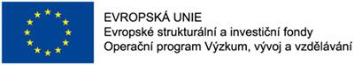

+++
title = "Projekty ESF" 
weight = 2
[extra]
heading = "Projekty ESF"
nav_right = true
icon = "ri-money-euro-circle-line"

+++

## 2018 - 2020 Podpora rozvoje digitální gramotnosti

Číslo projektu:	CZ.02.3.68/0.0/0.0/16_036/0005366  
Typ projektu:	ESF OP VVV  
#### Cíl projektu	
vybudování didaktické a metodické podpory začínajícím i stávajícím učitelům z praxe pro vhodné a přirozené začleňování vzdělávacích aktivit zaměřených na rozvoj digitální gramotnosti do výuky ve všeobecně vzdělávacích předmětech základního a středního školství v kontextu plánované revize národních kurikulárních dokumentů  

Manažer projektu:	PhDr. Tomáš Jeřábek, Ph.D.  
Garant KITTV:	PhDr. Tomáš Jeřábek, Ph.D.  
Řešitelé za KITTV:	zapojeno celé pracoviště  
Odkazy:	[digigram.cz](https://digigram.cz/) 
 	 
## 2018 - 2020 Podpora rozvíjení informatického myšlení (PRIM)

Číslo projektu:	CZ.02.3.68/0.0/0.0/16_036/0005322  
Typ projektu:	ESF OP VVV  
#### Cíl projektu
Projekt předpokládá vytvoření a pilotní ověření ucelených sad výukových materiálů pro všechny stupně škol, ale také systému vzdělávání učitelů vyučujících informatiku v pregraduálním vzdělávání i v praxi. Současně bude popularizovat témata související s informatickým myšlení jako jsou programování, porozumění informacím a robotika.  

Manažer projektu:	Jihočeská univerzita v Českých Budějovicích  
Garant KITTV:	doc. RNDr. Miroslava Černochová, CSc.  
Řešitelé za KITTV:	PhDr. Jiří Štípek, PhDr. Josef Procházka, Ph.D., PhDr. Petra Vaňková, Ph.D., PhDr. Jakub Lapeš, PhDr. Daniel Tocháček  
Odkazy:	[imysleni.cz](https://imysleni.cz/)
 	 
## 2017- 2019 SC2/5 
### Zvýšení kvality vzdělávání žáků, rozvoje klíčových kompetencí, oblastí vzdělávání a gramotností 

Číslo projektu:	CZ.02.3.68/0.0/0.0/16_011/0000664  
Typ projektu:	ESF OP VVV, osa PO 3  
#### Cíl projektu	
podpora profesních kompetencí učitelů/studentů, s klíčovými dopady na žáky v souladu s definovanými cíli RVP.  

Manažer projektu:	doc. PhDr. PaedDr. Anna Kucharská, Ph.D.  
Garant KITTV:	PhDr. Petra Vaňková, Ph.D.  
Řešitelé za KITTV:Ing. Bořivoj Brdička, Ph.D. a PhDr. Daniel Tocháček  
Odkazy:	[http://pages.pedf.cuni.cz/sc25/](http://pages.pedf.cuni.cz/sc25/)
 	 
## 2011- 2014 Vzdělávání DVPP
### Další vzdělávání pedagogických pracovníků na PedF UK Praha

Číslo projektu:	CZ.1.07/1.3.00/19.0002
Typ projektu:	ESF OPVK, osa 1.3
Cíl projektu:	Zvýšit kvalifikovanost pedagogických pracovníků ve vybraných vzdělávácích programech.
Manažer projektu:	PhDr. Pavla Košťálová, Ph.D.
Garant KITTV:	PaedDr. Ladislav Reitmayer, CSc.
Řešitelé za KITTV:	
Ing. Irena Fialová, CSc., Mgr. Viktor Fuglík, Ph.D., Ing. Petra Tobolářová
Odkazy:	[vzdelavani-dvpp.eu](http://it.pedf.cuni.cz/vzdelavani-dvpp/)
 	 
## 2011 - 2012 ICT školám
### Přispět k dostupnosti, kvalitě a efektivitě DVPP ve školách a Středočeského kraje cestou zvýšení kompetencí funkčního využívání prostředků ICT

Číslo projektu:	CZ.1.07/1.3.04/03.0010  
Typ projektu:	ESF OPVK, osa 1.3  
#### Cíl projektu
Výzkum a srovnání dopadu využívání ICT na evropských základních školách

Manažer projektu:	PhDr. Jiří Štípek, Ph.D.  
Řešitelé za KITTV:	doc. PhDr. Vladimír Rambousek, CSc., Mgr. Viktor Fuglík, Ing. Petra Tobolářová  
Odkazy:	[ict-skolam.eu](http://it.pedf.cuni.cz/ict-skolam/)
 	 
## 2009 – 2012 Čtenářská gramotnost
### Rozvoj čtenářských kompetencí v prostředí inkluzivní školy

Číslo projektu:	CZ.1.07/1.1.00/08.0061
Typ projektu:	ESF OPVK, osa 1.1
#### Cíl projektu
Zvýšit úroveň čtenářské gramotnosti žáků, rozšířit kvalifikaci pedagogických pracovníků a zpracovat a inovovat metodické a výukové materiály

Manažer projektu:	doc. PaedDr. Radka Wildová, CSc.  
Řešitelé za KITTV:	doc. PhDr. Vladimír Rambousek, CSc., PhDr. Jiří Štípek, Mgr. Miloš Prokýšek  
Odkazy:	[cteme.eu](http://www.cteme.eu)
 	 
### 2006 – 2008 Program Iniciativy Společenství EQUAL
Název projektu:	Deep-laid regiony

Typ projektu: ESF  
Garance projektu:	SOUTR - Střední odborné učiliště tradičních řemesel, spol. s r. o., Brno  
Manažer projektu:	Ing. Antonín Horák  
Garant PedF UK:	doc. Ing. František Mošna, CSc.  
 	 
### 2005 - 2007 ESF RLZ Opatření 3.1 Rozvoj počátečního vzdělávání jako základu celoživotního učení a z hlediska potřeb trhu práce a ekonomiky znalostí
Název záměru:	Rozvoj výuky přírodovědných a technických předmětů s ohledem na specifika velkoměsta - kombinované kurzy s online podporou pro učitele a žáky  
Žadatel:	Univerzita Karlova v Praze, MFF  
Kontaktní osoba za PedF UK:	doc. RNDr. Miroslava Černochová, CSc.  
#### Stručná anotace:	
Projekt řeší kritický nedostatek kurzů dalšího vzdělávání pro učitele přírodovědných a technických předmětů a zároveň nedostatečnou motivaci žáků vyšších ročníků základní školy a studentů nižších ročníků středních škol ke studiu a dalšímu vzdělávání v těchto oborech.
V průběhu projektu bude vytvořeno 5 kombinovaných kurzů ve dvou variantách - učitelské a žákovské, s výraznou online podporou, důrazem na mezipředmětové vazby a respektem ke specifikům velkoměsta. Kurzy se zaměřují na rozvoj klíčových kompetencí učitelů i žáků, týmovou práci a inovativní přístup k výuce i učení se. V těchto kurzech bude proškoleno celkem 110 účastníků v týmech tvořených učitelem a 1-2 žáky/studenty z téže školy.  
Výsledky jejich týmové práce budou publikovány a zpřístupněny učitelské veřejnosti. V zájmu udržitelnosti navrhovaného řešení budou vytvořené kurzy akreditovány pro DVPP MŠMT a poskytnuty zúčastněným školám. Zájemci z řad učitelů těchto škol budou v rámci projektu proškoleni jako budoucí lektoři.

Projekt je spolufinancován Evropským sociálním fondem, státním rozpočtem České republiky a rozpočtem hl.m.Prahy.
 	 
### 2006 - 2008 ESF RLZ Opatření 3.1 Rozvoj počátečního vzdělávání jako základu celoživotního učení a z hlediska potřeb trhu práce a ekonomiky znalostí	 
Název záměru:	Podpora tvorby a zavedení školních vzdělávacích programů s komponentou ekonomické gramotnosti  
Žadatel:	Univerzita Karlova v Praze, PedF  
Kontaktní osoba za PedF UK:	Ing. Jaroslav Novák, Ph.D.  
 	 
### 2006 - 2008 ESF JPD3 Opatření 3.1 Rozvoj počátečního vzdělávání jako základu celoživotního učení a z hlediska potřeb trhu práce a ekonomiky znalostí
Název záměru:	Ekogramotnost pro udržitelný rozvoj v Praze 
Nositel:	KEV  
Kontaktní osoba za PedF UK:	PhDr. Václav Pumpr  
Řešitelé za KITTV:	Ing. Jaroslav Novák, Ph.D., doc. PhDr. Vladimír Rambousek, CSc..  
 	 
###  2006 - 2008 ESF JPD3 Opatření 3.1 Rozvoj počátečního vzdělávání jako základu celoživotního učení a z hlediska potřeb trhu práce a ekonomiky znalostí
Název:	Transformace výuky ICT v rámci strukturovaných studií na UK PedF, příprava kombinované formy výuky kurzů a zpracování distančních a elektronických opor výuky  
Nositel:	UK v Praze, PedF UK  
Kontaktní osoba:	Ing. Jaroslav Novák, Ph.D.  